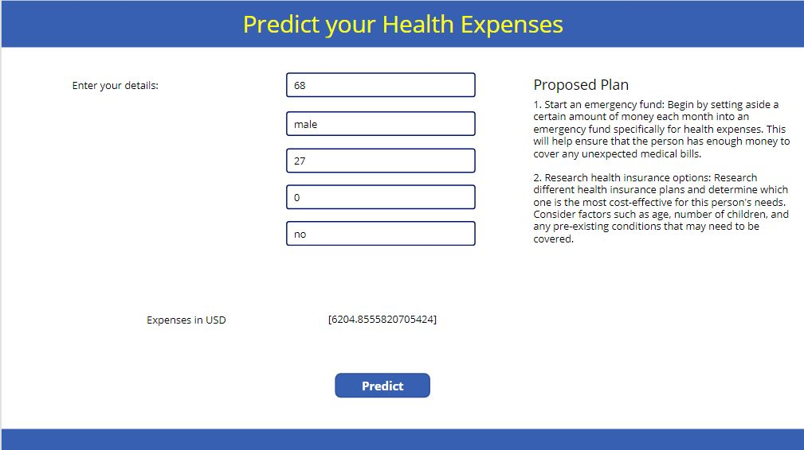
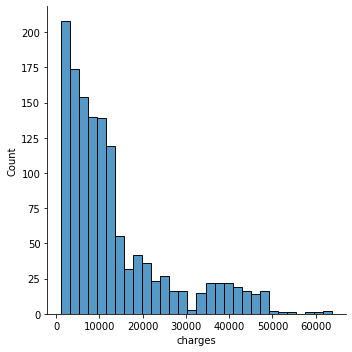
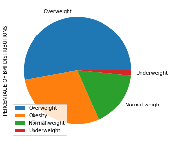
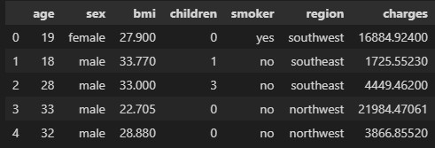
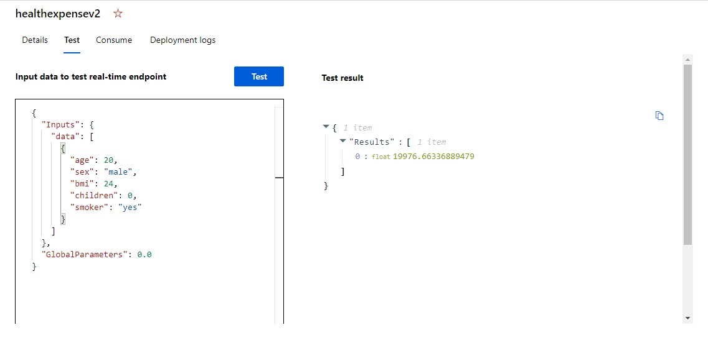
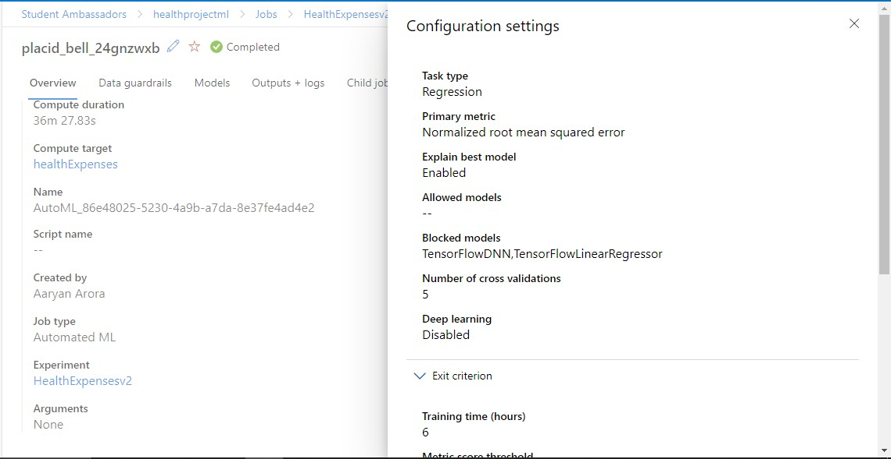
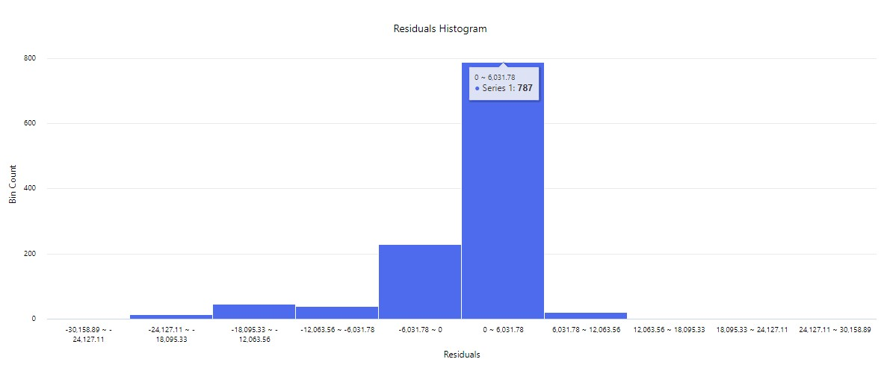
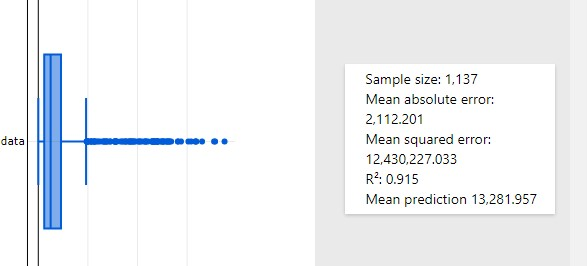

# Medicine Demand Prediction and Health Expense Prediction & Planning
## Medicine Demand Prediction
### This notebook uses time series and generates required features.
The aim of the project is to use a suitable model to predict medicine demand.

## Health Expense Prediction & Planning
This app allows the user to predict their Health Expense using a Machine Learning Model and then get a detailed personalized plan to save funds for it.

This section comprised of 5 parts:
1. Data Exploration using Python of the [dataset](https://www.kaggle.com/datasets/mirichoi0218/insurance)
2. Azure AutoML Regression Model to predict the health expenses for an individual based on various input parameters.
3. Using Open AI to create a customized Health Expense Saving Plan for the individual.
4. A Power Automate Flow to consume the Azure AutoML Model's endpoint and connect it to the Power App
5. Power Apps based interface to bring it all together

|Starting Screen|Output 1 |Output 2 |
:-------------------------:|:-------------------------:|:-------------------------:
 |  | 

### Features
This app allows the user to:
* Predict Health expenses based on various parameters like age, sex, bmi, number of children and whether they are a smoker or not
* Uses a custom built Azure Auto ML model integrated to Power Apps using Power Automate Flow
* Provides a customized plan to save for health expenses based on inputs and the result of the model using Open AI's API

### Power Automate Flow
Uses a Power Automate Flow to pass the input to the model and get the results back.

* The flow uses HTTP to POST the inputs to the Model Endpoint
* It then uses Parse JSON to parse the output
* Finally sends it back to the Power App

A screenshot for the flow:

### Azure Auto ML Model

#### Data Exploration:
 |  | 

#### Model:
 |  |  | 

Deployed Model Endpoint URL: [Link](http://c692c678-bd90-41d8-ac5f-5d1d140d196e.centralindia.azurecontainer.io/score)

Deployed App URL: [Link](https://apps.powerapps.com/play/e/cf46801e-aa6d-4a32-a161-692e900c34cc/a/6f7695e5-11d7-4fa1-96e9-bd0aae6bd6f7?tenantId=84c31ca0-ac3b-4eae-ad11-519d80233e6f)

# Medicine Demand Healthbox
## Healthbox Version 1.0.0
This model specifically deals with prediction of demand based on a particular dataset. It works on the basis of timeseries where appropriate features are extracted to get the best type of model then a xgboost training model.

 

